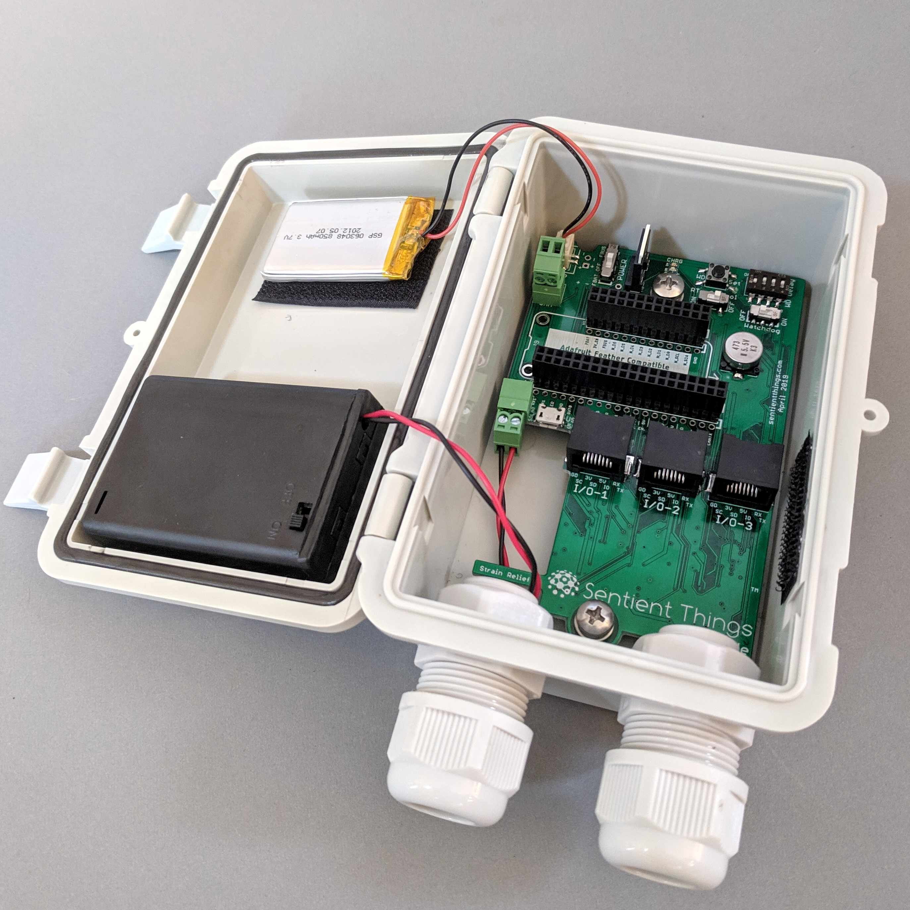
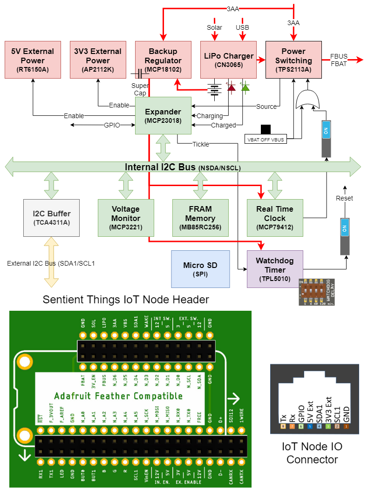
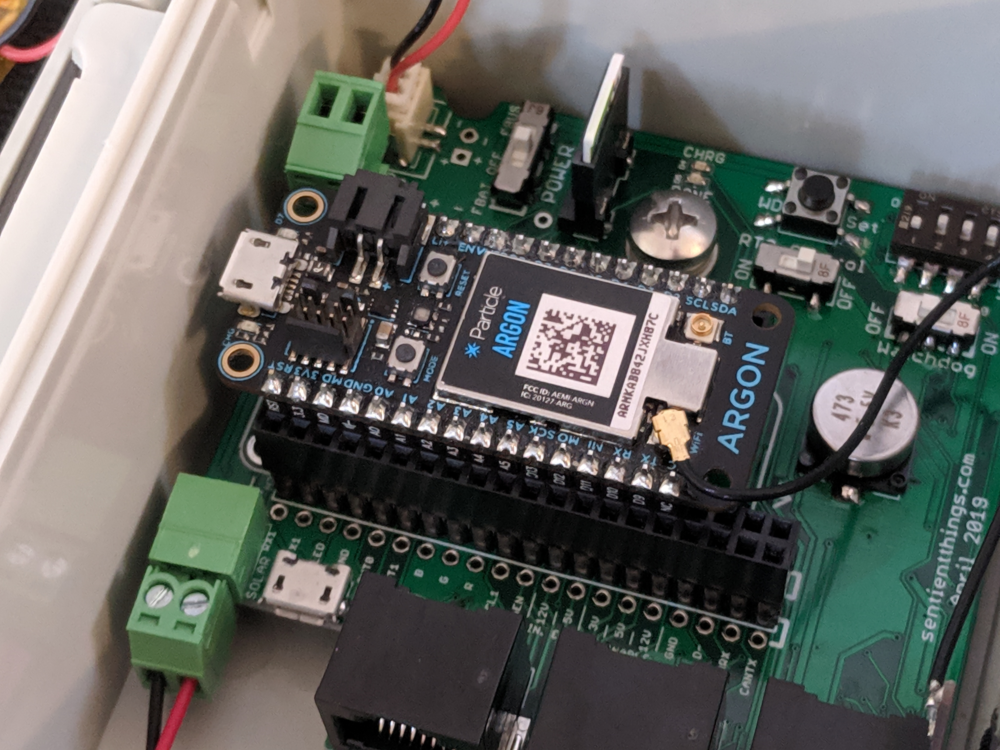
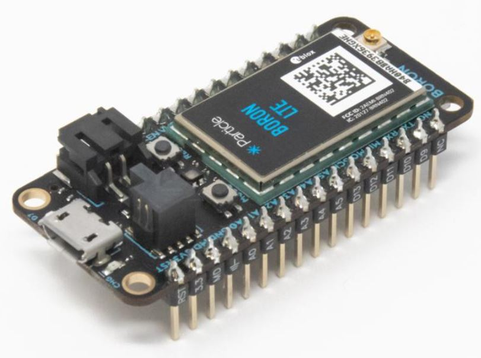
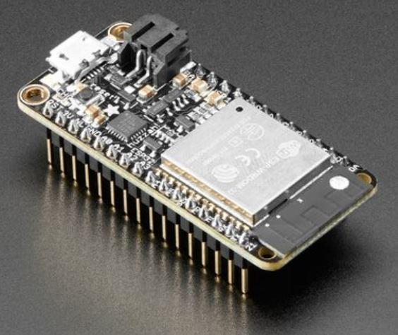
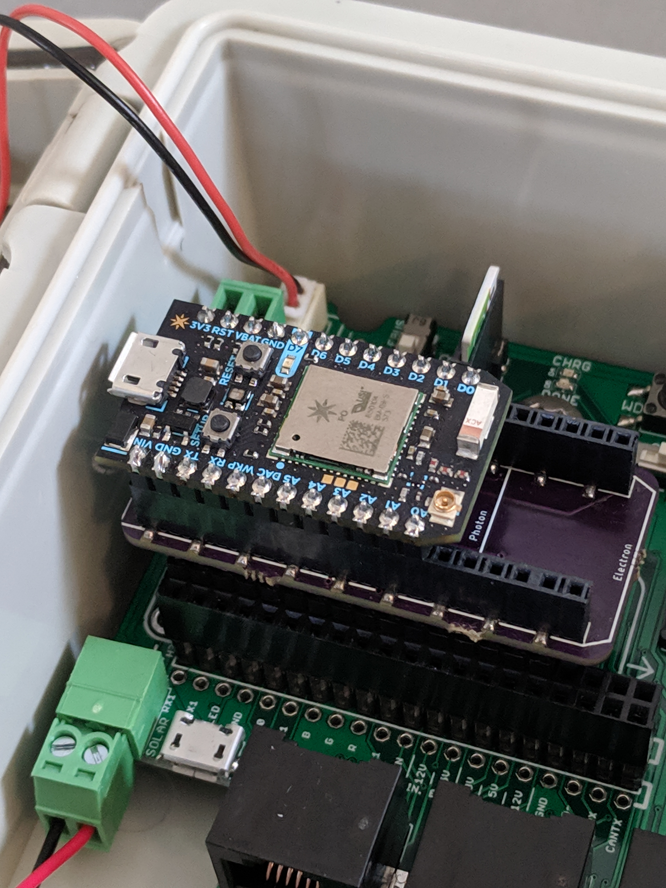
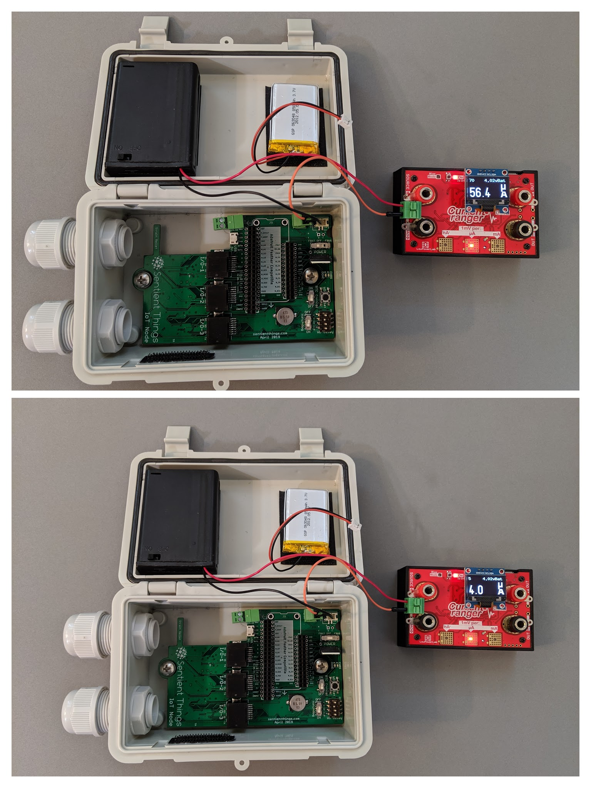
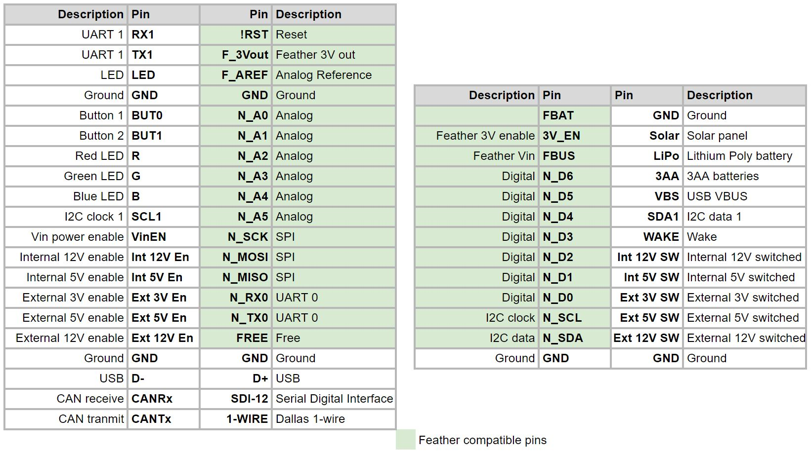
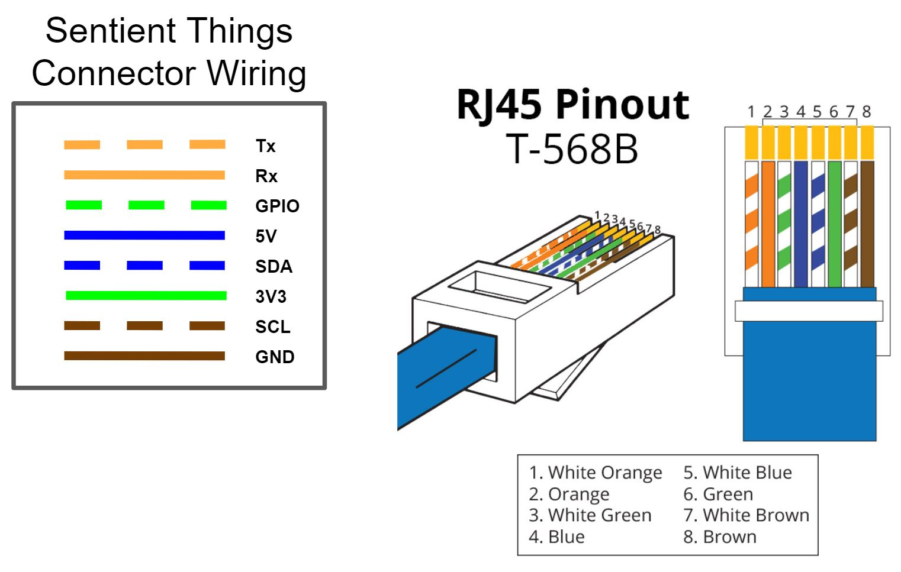

# IoT Node

The IoT Node board includes the most common peripheral components for IoT solutions plus a stackable expansion header for your favorite communication module. Add stackable adapter boards to provide additional functionality. The IoT Node board is designed to fit a hinged waterproof enclosure.

The IoT Node is general purpose and may be used for wide range of IoT applications ranging from environmental monitoring to industrial control.

### Features

Some of the most important features of the IoT Node include

* Multiple power options including mains, solar, and battery.  Battery options include Li-poly and AA.
* Power regulation and management for peripherals and external devices like sensors. Switched 3.3V and 5V regulators.
* Non-volatile FRAM and micro-SD card memory for keeping track of state and for data logging.
* A real-time-clock for time keeping and for scheduled power control of the communication module and peripherals.
* A watch dog timer for reliability.
* Pluggable expansion headers for communication modules and for adapter boards.
* Header compatibility with the popular Adafruit Feather boards enabling the use of a wide range of peripherals and communication modules including the new Particle Wi-Fi, cellular, and mesh modules.
* Input and Output connectors using RJ-45 sockets with standard pinouts for easy connection of sensors and actuators.
* Low power capability with communication modules operating in sleep mode.
* A rugged watertight enclosure.

### Block Diagram

### Communications Modules

The Adafruit Feather and new Feather-based Particle cellular, Wi-Fi, and mesh modules may be plugged directly into the IoT Node header. Making the communication module a separate plug in provides significantly flexibility and enables the use of the latest and greatest communication module in a market that is changing very rapidly.

Some commonly available Feather compatible communication boards include the Particle Wi-Fi, cellular \(Boron LTE CAT-M1 and 2G/3G\), and mesh,

and the Adafruit series of Wi-Fi and cellular Feather boards including the Adafruit ESP32 Feather Board,

Feather M0 WiFi, Feather 32u4 FONA, STM32F205 with Cypress WICED WiFi, and the Feather 32u4 RFM96 LoRa among others.

Other communications modules can be added using custom adapter boards such as the Particle Photon or Electron to Feather adapter board shown below.

### Power Supply Options

The IoT Node has multiple power options including three AA batteries and/or 6V solar or 5V micro USB charging a 4.2V Li-poly battery.  The IoT Node includes a TPS2113 power multiplexer that switches automatically between the Li-poly battery and three AA batteries.  The IoT Node charges the Li-poly battery from solar or mains power using a CN3065 charger. Power can be switched to the FBAT or the FBUS pin on the header.

Note that the real time clock and the watchdog timer are powered directly by the LiPo and/or 3AA batteries through an ultra low quiescent MCP18102 3.3V regulator and are not disconnected by the Power switch. DONE and CHARGE LEDs show the state of charge for the LiPo battery.

#### Current Consumption

The current consumption of the IoT Node without a microcontroller or adapter board plugged into the header is driven by the consumption of the circuitry on the IoT Node that is connected directly to the the AA and/or the LiPo battery.  The IoT Node includes a TPS2113A that automatically switches from a LiPo power source to an AA power source \(if present\).  The TPS2113A is also controlled by the real-time clock that is directly powered by the batteries.  The measured current consumption with the TPS2113A off is less than 10μA.  With the TPS2113A enabled \(i.e. when power is being sent to the header\) the measured current consumption is less than 65μA.  Since the real-time clock may be used control power to the header, less than 10μA represents the expected current consumption of the IoT Node when the real-time clock is used to switch power off to any adapters or microcontrollers plugged into the header.

### Expandable Header

The IoT Node includes a header to accommodate additional adapter boards as well as a communication module.

The IoT Node header is a superset of the Adafruit Feather header with the following pinouts:

### Input and Output Connectors

The IoTNode includes three RJ-45 IO connectors with the followings pinouts:

The I2C bus on the connectors are buffered using a TCA4311 buffer to prevent faults on the external I2C bus from affecting the internal I2C bus that communicates with devices on the IoT Node board. The GPIO pins are connected to the internal MCP23018 expander - see the schematic for details.

Additional IO connectors can be added using adapter boards.

### Power Management and Regulation

The IoT Node includes an ultra low quiescent MCP18102 3.3V regulator to supply backup power to the MCP73410 real-time clock and watch dog timer circuit. The I2C expander controls external 3.3V and 5V power outputs, monitors the state of the solar charger, and is used to "tickle" the watchdog clock. MAX40200 ideal diode switch power to the F\_BAT or F\_BUS pins on the header. Ideal diodes switch more current than the power slide switch and prevent current flowing back to the solar charging circuit when the microcontroller is powered directly.

### Memory

The IoT node includes a micro SD card socket as well as 256kbits of I2C FRAM memory.

### Watchdog Timer

A TPL5010 watchdog timer provides a means to reset the communications module and peripherals in the event of a software failure.

A slide switch enables or disables the Watchdog and a reset button resets the Watchdog timer.  When the Watchdog timer is reset it also sets the timer period. The Watchdog timer period is set by a 4-way DIP switch.  The resistance set by the DIP switch varies the watchdog period between 11 seconds and 120 minutes.

The DIP switch provides the following delay options.

| 1 | 2 | 3 | 4 | Delay \(min.\) |
| :--- | :--- | :--- | :--- | :--- |
| ON | ON | ON | ON | 11s |
| OFF | ON | ON | ON | 1 |
| ON | OFF | ON | ON | 3 |
| OFF | OFF | ON | ON | 6 |
| ON | ON | ON | OFF | 8 |
| OFF | ON | ON | OFF | 12 |
| ON | OFF | ON | OFF | 18 |
| OFF | OFF | ON | OFF | 25 |
| ON | ON | OFF | ON | 33 |
| OFF | ON | OFF | ON | 43 |
| ON | OFF | OFF | ON | 53 |
| OFF | OFF | OFF | ON | 66 |
| ON | ON | OFF | OFF | 72 |
| OFF | ON | OFF | OFF | 88 |
| ON | OFF | OFF | OFF | 102 |
| OFF | OFF | OFF | OFF | 120 |

Please refer to the Texas Instruments [TPL5010 datasheet](http://www.ti.com/lit/ds/symlink/tpl5010.pdf) for further details.The reset output of the Watchdog timer is connected to the RST line which is pulled low to reset. The WAKE output of the Watchdog timer is connected to the WAKE pin and the DONE input is connected to the MCP23018 I/O expander.  The DONE input is used by the communication module to “tickle” the Watchdog timer to show that it is still operational and to prevent a reset from occurring.

### Real-Time Clock

A MCP73410 I2C real-time-clock provides timekeeping as well as the ability to control the power on the IoT Node by enabling or disabling the TPS2113 power multiplexer. This feature may be used to reduce power consumption and is particularly useful for communication modules that consume relatively high power even when operating in sleep mode.

The RTC Control slide switch enables and disables the timed control of the F\_BUS or F\_BAT power to the header.

### Battery Voltage Monitor

A MCP3221 I2C analog-to-digital converter monitors the voltage at the output of the TPS2113 power multiplexer.

### Enclosure

The IoT Node is designed to fit a 6 x 4.5 x 3 inch waterproof enclosure. A hinged lid provides easy access to the IoT Node for setup and maintenance. The enclosure includes holes for input and output cabling. A combination of cable glands, hole plugs, or vents may be used.

### Hardware Files and Schematics

[https://github.com/sentientthings/IoT-Node](https://github.com/sentientthings/IoT-Node)

