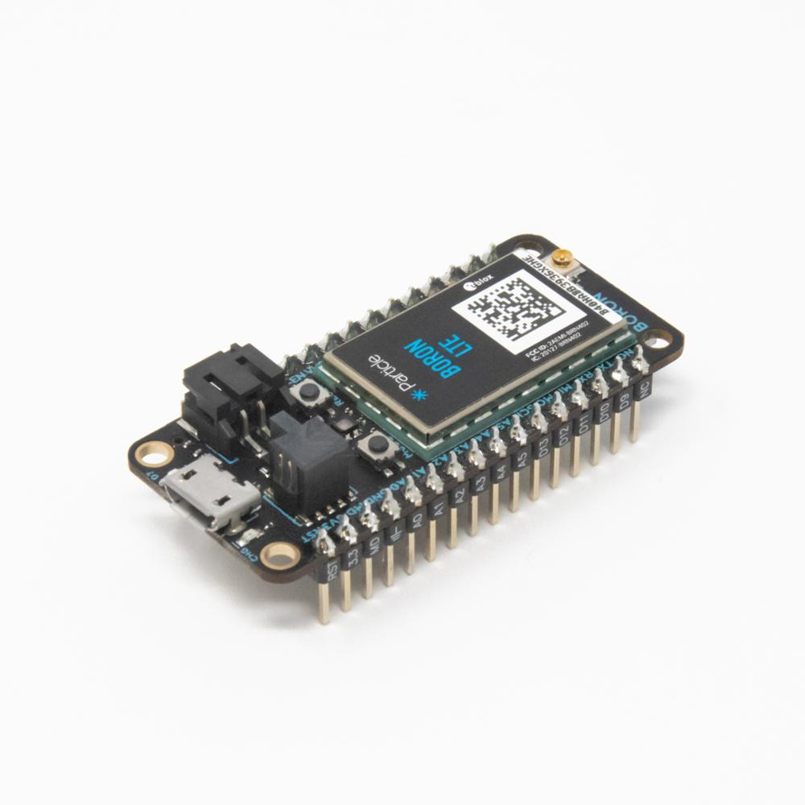
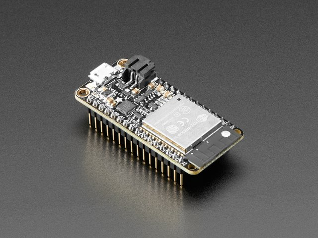

# IoT Node

The IoT Node board includes the most common peripheral components for IoT solutions and includes a stackable expansion header for your favorite communication module. Add stackable adapter boards to provide additional functionality. The IoT Node board is designed to fit a hinged waterproof enclosure.

The IoT Node is general purpose and may be used for wide range of IoT applications ranging from environmental monitoring to industrial control.

### Features

Some of the most important features of the IoT Node include

* Multiple power options including mains, solar, and battery.  Battery options include Li-poly and AA.
* Power regulation and management for peripherals and external devices like sensors. Switched 3.3V and 5V regulators.
* Non-volatile FRAM and micro-SD card memory for keeping track of state and for data logging.
* A real-time-clock for time keeping and for scheduled power control of the communication module and peripherals.
* A watch dog timer for reliability.
* Pluggable expansion headers for communication modules and for adapter boards.
* Screw terminals that breakout the pins of the expansion headers for flexible I/O.
* Header compatibility with the popular Adafruit Feather boards enabling the use of a wide range of peripherals and communication modules including the new Particle Wi-Fi, cellular, and mesh modules.
* Low power capability with communication modules operating in sleep mode.
* A rugged watertight enclosure.

### Communications Modules

The Adafruit Feather and new Feather-based Particle cellular, Wi-Fi, and mesh modules may be plugged directly into the IoT Node header. Making the communication module a separate plug in provides significantly flexibility and enables the use of the latest and greatest communication module in a market that is changing very rapidly.

Some commonly available Feather compatible communication boards include the Particle Wi-Fi, cellular \(Boron LTE CAT-M1 and 2G/3G\), and mesh,

and the Adafruit series of Wi-Fi and cellular Feather boards including the Adafruit ESP32 Feather Board,

Feather M0 WiFi, Feather 32u4 FONA, STM32F205 with Cypress WICED WiFi, and the Feather 32u4 RFM96 LoRa among others.

Other communications modules can be added using a custom adapter board.

