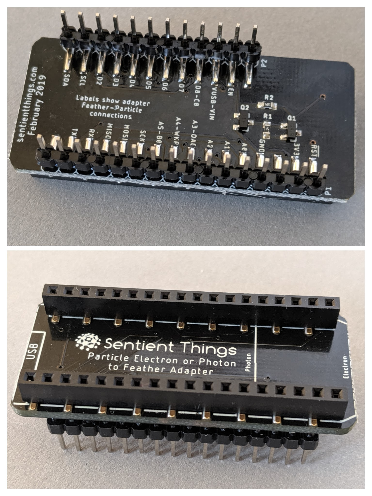

# Particle to Feather Adapter

## Introduction

The Sentient Things Particle to Feather Adapter converts Particle Photons and Particle Electrons to a Feather compatible footprint.

## Description

The Sentient Things Particle to Feather Adapter includes circuitry that uses the regulated 3.3V from the Photon or Electron.  The Particle 3.3V is fed to the Feather 3.3V output and is enabled \(high\) per the Feather standard using the 3V enable pin.

## Schematic

## Hardware files

The hardware files for the Particle to Feather adapter are published on[ Github](https://github.com/sentientthings/Particle_to_Feather_Adapter).

