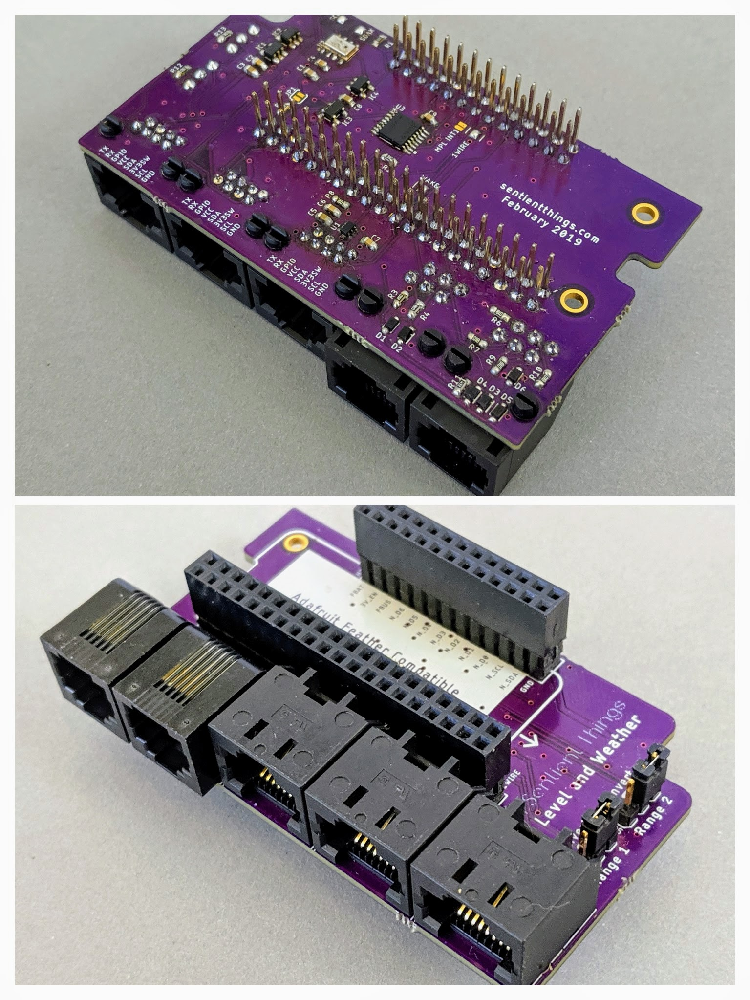

# Weather and Level Adapter

## Introduction

The Sentient Things Weather and Level Adapter is a board that plugs into the IoT Node Header to provide interfaces to the following sensors:

* [Sparkfun Weather Meters](https://www.sparkfun.com/products/8942)
* [Maxbotix range sensors](https://www.maxbotix.com/) \(up to two\)
* [DS18B20 waterproof temperature sensor](https://www.adafruit.com/product/381)

The Weather and Level Adapter includes an on-board [MPL3115A2](http://cache.freescale.com/files/sensors/doc/data_sheet/MPL3115A2.pdf) pressure and altitude sensor.

## Description

The board includes logic to select one of two Maxbotix range sensors using the N\_D5 pin on the IoT Node Header.  Level translation is provided to operate the Maxbotix sensors at 5V. Onboard jumpers enable optional inversion of the Maxbotix signal for sensors that output RS232 compatible serial \(idle low\).

Level conversion circuitry interfaces with a 1-wire device \(DS18B20\) operating at 5V.

## Schematic

## Hardware files

The hardware design files for the Weather and Level Adapter are published on [Github](https://github.com/sentientthings/Weather_and_Level_Adapter).

